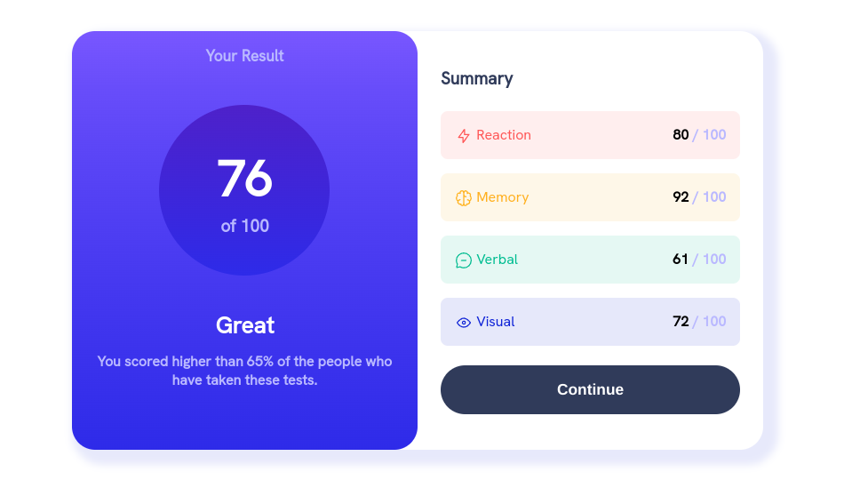
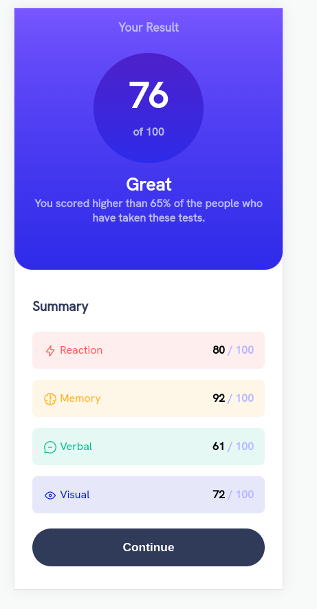
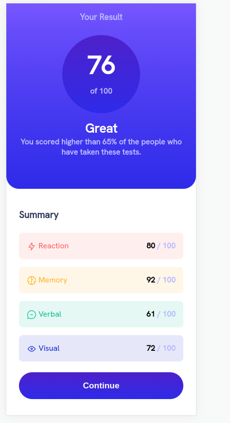

# Frontend Mentor - Results summary component solution

This is a solution to the [Results summary component challenge on Frontend Mentor](https://www.frontendmentor.io/challenges/results-summary-component-CE_K6s0maV). Frontend Mentor challenges help you improve your coding skills by building realistic projects. 

## Screenshots

    
    
    

 

### Links
- Solution URL:https://result-summary-nava.netlify.app/

### The challenge
    Users should be able to:

    - View the optimal layout for the interface depending on their device's screen size
    - See hover and focus states for all interactive elements on the page

### Built with

- Semantic HTML5 markup
- CSS custom properties
- Flexbox

### What I learned

In this project the thing that I learned was to have more structure on my css's files but at the same time to not overenginner my css file to some point that will be hard to search for one thing, nevertheless, I have to say that I am very proud of this mini-exercise...

------  
<h1>Improving my skills 🚀 🚀 🚀</h1

### Where u can give a me a touch 🤙 : 

- link to my profile on front end mentor:
    * https://www.frontendmentor.io/profile/juannava67

**Improving Front end skills** 🚀
